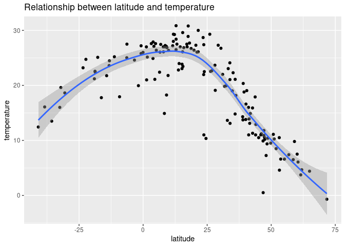
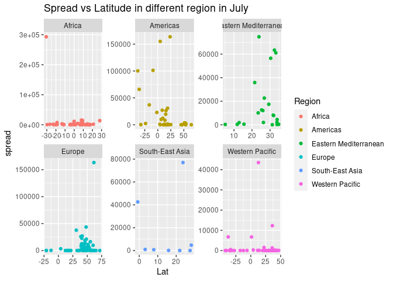
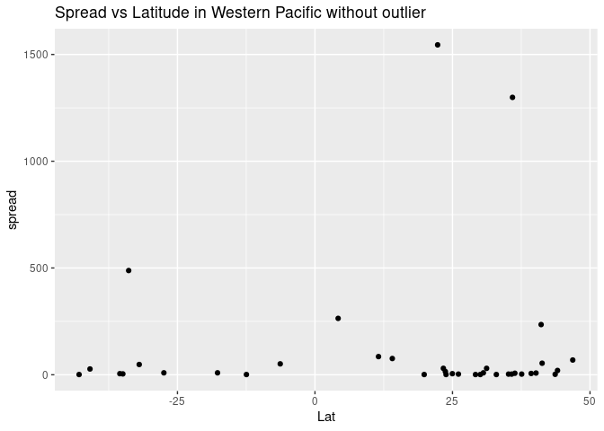
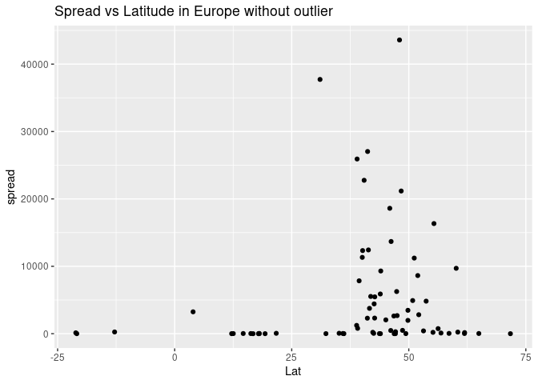
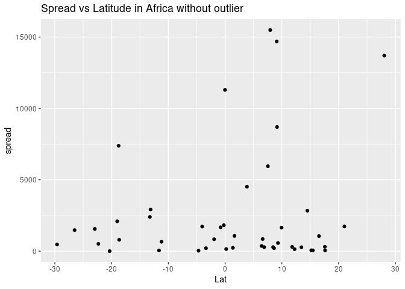
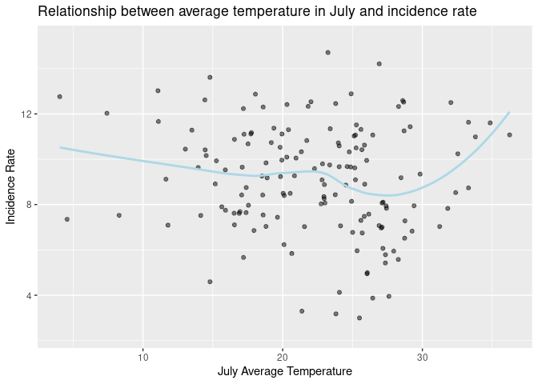
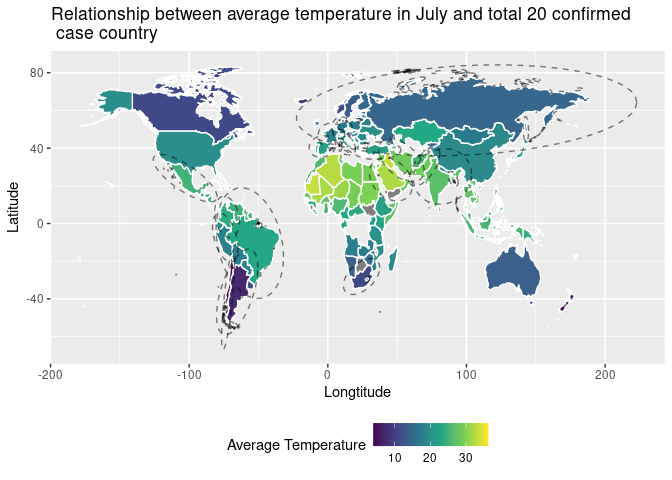
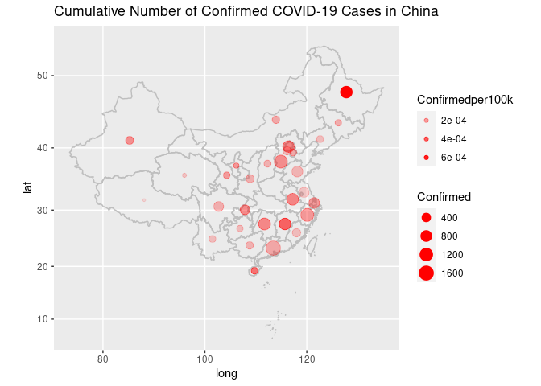
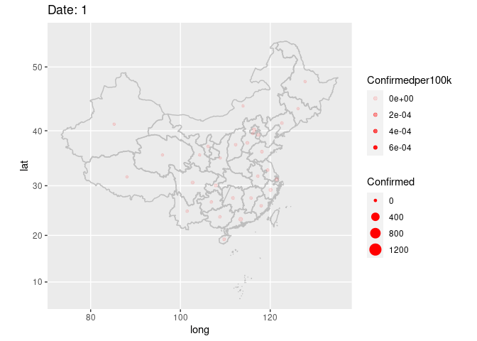
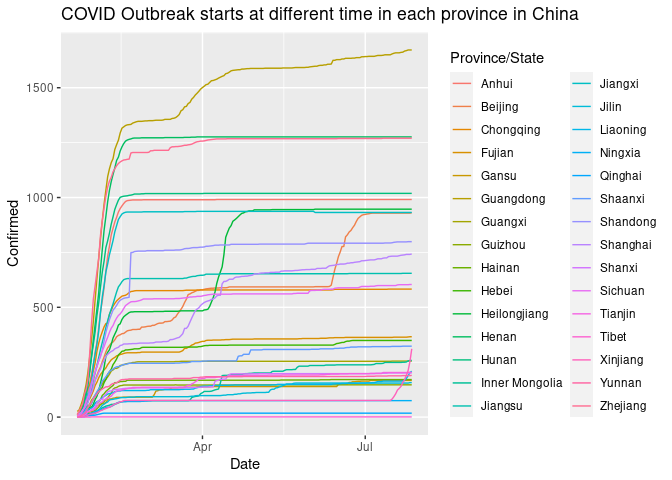

COVID-19: Effects of Temperature
================
Team Zeta
2020-10-27

  - [Load the dataset](#load-the-dataset)
  - [Longitude, Temperature and
    COVID19](#longitude-temperature-and-covid19)
  - [Relationship Between Latitude and the Spread of the Virus in
    July](#relationship-between-latitude-and-the-spread-of-the-virus-in-july)
  - [Relationship between average temperature in July and incidence
    rate](#relationship-between-average-temperature-in-july-and-incidence-rate)
  - [Relationship between average temperature in July and top 20
    countries with total confirmed
    case](#relationship-between-average-temperature-in-july-and-top-20-countries-with-total-confirmed-case)
  - [Case Study: China](#case-study-china)
  - [Conclusion](#conclusion)

*Background*:
[COVID-19](https://en.wikipedia.org/wiki/Coronavirus_disease_2019) is
the disease caused by the virus SARS-CoV-2. In 2020 it became a global
pandemic, leading to huge loss of life and tremendous disruption to
society. The New York Times (as of writing) publishes up-to-date data on
the progression of the pandemic across the United States—we will study
these data in this challenge.

``` r
library(tidyverse)
```

    ## ── Attaching packages ────────────────────────────────────────────────── tidyverse 1.3.0 ──

    ## ✓ ggplot2 3.3.2     ✓ purrr   0.3.4
    ## ✓ tibble  3.0.3     ✓ dplyr   1.0.2
    ## ✓ tidyr   1.1.2     ✓ stringr 1.4.0
    ## ✓ readr   1.4.0     ✓ forcats 0.5.0

    ## ── Conflicts ───────────────────────────────────────────────────── tidyverse_conflicts() ──
    ## x dplyr::filter() masks stats::filter()
    ## x dplyr::lag()    masks stats::lag()

``` r
library(ggrepel)
library(ggpubr)
library(devtools)
```

    ## Loading required package: usethis

``` r
library(ggplot2)
library(proto)
library(base)
library(lubridate)
```

    ## 
    ## Attaching package: 'lubridate'

    ## The following objects are masked from 'package:base':
    ## 
    ##     date, intersect, setdiff, union

``` r
library(sf)
```

    ## Linking to GEOS 3.8.0, GDAL 3.0.4, PROJ 6.3.1

``` r
library(tmap)
library(maptools)
```

    ## Loading required package: sp

    ## Checking rgeos availability: TRUE

``` r
library(gganimate)
```

## Load the dataset

``` r
#covid_oct_filename <- "./data/COVID/covid_19.csv"
#covid_july_filename <- "./data/COVID/covid_19_july.csv"
#covid_may_filename <- "./data/COVID/covid_19_may.csv"
covid_july_filename <- "./data/covid_19_july.csv"
PopulationChina <- "./data/AnnualbyProvince.csv"
filename <- "./data/covid_19_clean_complete.csv"
temp_filename <- "./data/temp.csv"
temperature_filename <- "./data/covid_19_temp.csv"

mydat = readShapePoly("bou2_4p.shp")
```

    ## Warning: readShapePoly is deprecated; use rgdal::readOGR or sf::st_read

``` r
df_covid <- read_csv(filename)
```

    ## 
    ## ── Column specification ───────────────────────────────────────────────────────────────────
    ## cols(
    ##   `Province/State` = col_character(),
    ##   `Country/Region` = col_character(),
    ##   Lat = col_double(),
    ##   Long = col_double(),
    ##   Date = col_date(format = ""),
    ##   Confirmed = col_double(),
    ##   Deaths = col_double(),
    ##   Recovered = col_double(),
    ##   Active = col_double(),
    ##   `WHO Region` = col_character()
    ## )

``` r
df_covidTemp <- read_csv(filename)
```

    ## 
    ## ── Column specification ───────────────────────────────────────────────────────────────────
    ## cols(
    ##   `Province/State` = col_character(),
    ##   `Country/Region` = col_character(),
    ##   Lat = col_double(),
    ##   Long = col_double(),
    ##   Date = col_date(format = ""),
    ##   Confirmed = col_double(),
    ##   Deaths = col_double(),
    ##   Recovered = col_double(),
    ##   Active = col_double(),
    ##   `WHO Region` = col_character()
    ## )

``` r
df_popChina <- read_csv(PopulationChina) %>% select("Province/State", "Pop (k)")
```

    ## 
    ## ── Column specification ───────────────────────────────────────────────────────────────────
    ## cols(
    ##   `Province/State` = col_character(),
    ##   `Pop (k)` = col_double(),
    ##   `2018` = col_double(),
    ##   `2017` = col_double(),
    ##   `2016` = col_double(),
    ##   `2015` = col_double(),
    ##   `2014` = col_double(),
    ##   `2013` = col_double(),
    ##   `2012` = col_double(),
    ##   `2011` = col_double(),
    ##   `2010` = col_double()
    ## )

``` r
df_temp <- read_csv(temp_filename)
```

    ## Warning: Missing column names filled in: 'X1' [1]

    ## 
    ## ── Column specification ───────────────────────────────────────────────────────────────────
    ## cols(
    ##   X1 = col_double(),
    ##   Country = col_character(),
    ##   City = col_character(),
    ##   Jan = col_double(),
    ##   Feb = col_double(),
    ##   Mar = col_double(),
    ##   Apr = col_double(),
    ##   May = col_double(),
    ##   Jun = col_double(),
    ##   Jul = col_double(),
    ##   Aug = col_double(),
    ##   Sep = col_double(),
    ##   Oct = col_double(),
    ##   Nov = col_double(),
    ##   Dec = col_double(),
    ##   Avg_Year = col_double(),
    ##   Continent = col_character()
    ## )

``` r
df_covid_july <- read_csv(covid_july_filename)
```

    ## 
    ## ── Column specification ───────────────────────────────────────────────────────────────────
    ## cols(
    ##   FIPS = col_double(),
    ##   Admin2 = col_character(),
    ##   Province_State = col_character(),
    ##   Country_Region = col_character(),
    ##   Last_Update = col_datetime(format = ""),
    ##   Lat = col_double(),
    ##   Long_ = col_double(),
    ##   Confirmed = col_double(),
    ##   Deaths = col_double(),
    ##   Recovered = col_double(),
    ##   Active = col_double(),
    ##   Combined_Key = col_character(),
    ##   Incidence_Rate = col_double(),
    ##   `Case-Fatality_Ratio` = col_double()
    ## )

``` r
df_temp2 <- read_csv(temperature_filename)
```

    ## Warning: Missing column names filled in: 'X1' [1]

    ## 
    ## ── Column specification ───────────────────────────────────────────────────────────────────
    ## cols(
    ##   .default = col_double(),
    ##   country = col_character(),
    ##   Density_KM2m = col_number(),
    ##   Fertility_rate = col_character(),
    ##   Median_age = col_character(),
    ##   Urban_pop_pct = col_character(),
    ##   sex_male_to_female_total = col_character()
    ## )
    ## ℹ Use `spec()` for the full column specifications.

## Longitude, Temperature and COVID19

``` r
df_covid %>% glimpse
```

    ## Rows: 49,068
    ## Columns: 10
    ## $ `Province/State` <chr> NA, NA, NA, NA, NA, NA, NA, NA, "Australian Capital …
    ## $ `Country/Region` <chr> "Afghanistan", "Albania", "Algeria", "Andorra", "Ang…
    ## $ Lat              <dbl> 33.93911, 41.15330, 28.03390, 42.50630, -11.20270, 1…
    ## $ Long             <dbl> 67.709953, 20.168300, 1.659600, 1.521800, 17.873900,…
    ## $ Date             <date> 2020-01-22, 2020-01-22, 2020-01-22, 2020-01-22, 202…
    ## $ Confirmed        <dbl> 0, 0, 0, 0, 0, 0, 0, 0, 0, 0, 0, 0, 0, 0, 0, 0, 0, 0…
    ## $ Deaths           <dbl> 0, 0, 0, 0, 0, 0, 0, 0, 0, 0, 0, 0, 0, 0, 0, 0, 0, 0…
    ## $ Recovered        <dbl> 0, 0, 0, 0, 0, 0, 0, 0, 0, 0, 0, 0, 0, 0, 0, 0, 0, 0…
    ## $ Active           <dbl> 0, 0, 0, 0, 0, 0, 0, 0, 0, 0, 0, 0, 0, 0, 0, 0, 0, 0…
    ## $ `WHO Region`     <chr> "Eastern Mediterranean", "Europe", "Africa", "Europe…

``` r
df_avg <- 
  df_covid %>%  
  rename(region = 'Country/Region')  %>%
  group_by(region)  %>%
  summarise (
    totalConfirm = sum(Confirmed),
    totalDeath = sum(Deaths), 
    long = mean(Long),
    lat = mean(Lat)
    ) 
```

    ## `summarise()` ungrouping output (override with `.groups` argument)

``` r
#df_avg
```

``` r
df_temp_avg <- 
  df_temp %>%
  group_by(Country) %>%
  summarise(
    avgOct = mean(Oct)
  ) %>%
  rename(region = Country)
```

    ## `summarise()` ungrouping output (override with `.groups` argument)

``` r
#df_temp_avg
```

``` r
df_temp_case <- merge(df_temp_avg,df_avg,by="region")
#df_temp_case
```

``` r
df_temp_case %>%
    ggplot(aes(lat, avgOct ) ) + 
    geom_point() + 
    geom_smooth(aes( group = 1 )) +
  labs(
    x= "latitude",
    y = "temperature",
    title = "Relationship between latitude and temperature "
  )
```

    ## `geom_smooth()` using method = 'loess' and formula 'y ~ x'

<!-- -->

**Observations** Latitudes are angles that range from zero degrees at
the equator to 90 degrees North or 90 degrees South at the poles. From
this graph, we can see that as the magnitude of latitude increases, the
temperature falls, and vice versa. Scientifically this is true as closer
to the country is to the equator, smaller the magnitude of latitude
becomes and higher the temperature rises. Therefore, we can conclude
that latitude is inversely related to temperature

``` r
df_avg %>%
  filter(totalConfirm < 2e7) %>%
  ggplot(aes(x = lat, y = totalConfirm)) +
  geom_point() + 
  geom_smooth() + 
  labs(
    x= "latitude",
    y = "total confirmed cases",
    title = "Relationship between latitude and confirmed cases "
  )
```

    ## `geom_smooth()` using method = 'loess' and formula 'y ~ x'

<!-- -->
**Observations**

Since we know the inverse relationship between latitude and the
temperature, from this graph, we can observe that closer the latitude is
to the equator, less COVID19 cases have been reported. And higher the
magnitude value of latitude, higher number of COVID19 cases have been
reported. Therefore, we know that higher the temperature, smaller the
magnitude value of latitude and COVID19 cases.

## Relationship Between Latitude and the Spread of the Virus in July

To make a deeper analysis, we decided July for the month to find the
relationship between the latitude and the spread of the virus in
different regions. The spread is calculated by subtracting the number of
cumulative confirmed cases on the first day of the month from the number
of cumulative confirmed cases on the last day of the month. In the graph
below, the x axis is the latitude, y axis is the spread and the color of
the graph indicates the region of the country.

``` r
names(df_covid)[names(df_covid) == "Province/State"] <- "Province_State"
names(df_covid)[names(df_covid) == "Country/Region"] <- "Country_Region"
names(df_covid)[names(df_covid) == "WHO Region"] <- "WHO_region"

df_cleancovid <-
  df_covid %>%
    filter(
      Date == "2020-07-01"| Date == "2020-07-27"
    ) %>%
    select(
      Province_State,
      Country_Region,
      Lat,
      Date,
      Confirmed,
      WHO_region
    ) %>%
    group_by(Province_State) %>%
    pivot_wider(
      names_from = Date,
      values_from = Confirmed
    )

  
names(df_cleancovid)[names(df_cleancovid) == "2020-07-01"] <- "Confirmed_start"
names(df_cleancovid)[names(df_cleancovid) == "2020-07-27"] <- "Confirmed_end"

df_cleancovid
```

    ## # A tibble: 261 x 6
    ## # Groups:   Province_State [79]
    ##    Province_State  Country_Region   Lat WHO_region Confirmed_start Confirmed_end
    ##    <chr>           <chr>          <dbl> <chr>                <dbl>         <dbl>
    ##  1 <NA>            Afghanistan     33.9 Eastern M…           31836         36263
    ##  2 <NA>            Albania         41.2 Europe                2580          4880
    ##  3 <NA>            Algeria         28.0 Africa               14272         27973
    ##  4 <NA>            Andorra         42.5 Europe                 855           907
    ##  5 <NA>            Angola         -11.2 Africa                 291           950
    ##  6 <NA>            Antigua and B…  17.1 Americas                69            86
    ##  7 <NA>            Argentina      -38.4 Americas             67197        167416
    ##  8 <NA>            Armenia         40.1 Europe               26065         37390
    ##  9 Australian Cap… Australia      -35.5 Western P…             108           113
    ## 10 New South Wales Australia      -33.9 Western P…            3211          3699
    ## # … with 251 more rows

``` r
df_spread <-
  df_cleancovid %>%
    mutate(
      spread = Confirmed_end - Confirmed_start
    ) %>%
  filter(
    spread<500000 & spread!=0
  )


df_spread %>%
  ggplot(aes(x = Lat, y = spread, color=WHO_region)) +
    geom_point()+
    facet_wrap(~WHO_region, scales = "free") +
    labs(color = "Region")+
    ggtitle("Spread vs Latitude in different region in July")
```

<!-- -->
**Observations ** In Eastern Mediterranean, the spread of the virus is
significantly large around latitude of 20 to 30. There’s a general
increasing trend. In South-East Asia, there’s no big trend of the
relationship between the latitude and the spread. There are outliers in
Africa, Europe, and Western Pacific that make the graph hard to observe
the trend.

We eliminated outliers for Western Pacific, Europe, and Africa to see
the trend of the graph.

``` r
df_spread %>%
  filter(
    WHO_region == "Western Pacific",
    spread < 5000
  ) %>%
  ggplot(aes(x = Lat, y = spread)) +
    geom_point()+ 
    ggtitle("Spread vs Latitude in Western Pacific without outlier")
```

<!-- -->
**Observations ** Most of the countries in Western Pacific have a spread
of below 500, except some large numbers of spread in latitude around 25.

``` r
df_spread %>%
  filter(
    WHO_region == "Europe",
    spread < 150000
  ) %>%
  ggplot(aes(x = Lat, y = spread)) +
    geom_point()+
    ggtitle("Spread vs Latitude in Europe without outlier")
```

<!-- -->
**Observations ** There’s no overall trend in the countries in Europe,
but there are a number of countries around latitude of 50 with
significantly large spread of the virus.

``` r
df_spread %>%
  filter(
    WHO_region == "Africa",
    spread < 100000
  ) %>%
  ggplot(aes(x = Lat, y = spread)) +
    geom_point()+
    ggtitle("Spread vs Latitude in Africa without outlier")
```

<!-- -->
**Observations ** There’s an increasing trend in the countries in
Africa.

## Relationship between average temperature in July and incidence rate

Then we combined the average temperature of July to do a fitting
analysis with the incidence rate, which describes how quickly disease
occurs in a population. The results are shown in the figure below.

``` r
covid_july <- df_covid_july %>% 
  select('Country_Region','Last_Update', 'Confirmed', 'Deaths', 'Recovered', 'Incidence_Rate') %>% 
  rename(
    region = 'Country_Region',
    Cases = 'Confirmed',
    ) %>% 
  separate(col='Last_Update',sep=' ', into=c('date', 'time'), remove = TRUE)

covid_sum_july <-covid_july %>% 
  drop_na(Incidence_Rate) %>% 
  group_by(region) %>% 
  summarise(
    logCases=log(sum(Cases)),
    meanIncidenceRate=mean(Incidence_Rate)
    ) 
```

    ## `summarise()` ungrouping output (override with `.groups` argument)

``` r
covid_sum_july$region[179]<-"USA"
```

``` r
world_map <- map_data("world")
```

``` r
temp <- df_temp2 %>% 
  select(country, july_temp) %>% 
  drop_na(july_temp) %>% 
  rename(region=country)
```

``` r
temp$region[144]<-"USA"
```

``` r
covid_sum_july <- covid_sum_july %>% 
  rename(
    logCasesJuly=logCases,
    meanIncidenceRateJuly=meanIncidenceRate
  )
```

``` r
covid_sum_july
```

    ## # A tibble: 186 x 3
    ##    region              logCasesJuly meanIncidenceRateJuly
    ##    <chr>                      <dbl>                 <dbl>
    ##  1 Afghanistan                10.5                  93.2 
    ##  2 Albania                     8.49                170.  
    ##  3 Algeria                    10.2                  63.8 
    ##  4 Andorra                     6.81               1174.  
    ##  5 Angola                      6.86                  2.89
    ##  6 Antigua and Barbuda         4.45                 87.8 
    ##  7 Argentina                  12.0                 370.  
    ##  8 Armenia                    10.5                1262.  
    ##  9 Australia                   9.64                 41.9 
    ## 10 Austria                     9.93                228.  
    ## # … with 176 more rows

``` r
covid_tmp <- left_join(covid_sum_july, temp, by = "region")
```

``` r
covid_tmp 
```

    ## # A tibble: 186 x 4
    ##    region              logCasesJuly meanIncidenceRateJuly july_temp
    ##    <chr>                      <dbl>                 <dbl>     <dbl>
    ##  1 Afghanistan                10.5                  93.2      25.3 
    ##  2 Albania                     8.49                170.       20.5 
    ##  3 Algeria                    10.2                  63.8      32.5 
    ##  4 Andorra                     6.81               1174.       NA   
    ##  5 Angola                      6.86                  2.89     17.9 
    ##  6 Antigua and Barbuda         4.45                 87.8      NA   
    ##  7 Argentina                  12.0                 370.        7.42
    ##  8 Armenia                    10.5                1262.       19.8 
    ##  9 Australia                   9.64                 41.9      14.0 
    ## 10 Austria                     9.93                228.       15.3 
    ## # … with 176 more rows

``` r
ggplot(covid_tmp, aes(july_temp, logCasesJuly))+
  geom_point(color='black',alpha=0.5)+
  geom_smooth(color="light blue",method="loess", se=F) +
  theme_grey()+
  labs(
    x = "July Average Temperature",
    y = "Incidence Rate",
    title = "Relationship between average temperature in July and incidence rate"
  )
```

    ## `geom_smooth()` using formula 'y ~ x'

    ## Warning: Removed 34 rows containing non-finite values (stat_smooth).

    ## Warning: Removed 34 rows containing missing values (geom_point).

<!-- -->
**Observations **

We can see that the relationship between temperature and incidence rate
is not linear. However, we observe that as the temperature rose above 30
celcius, the spread of the virus converged (this also happens when the
temperature falls to below 5 celsius). This implies the virus is mostly
active within a certain temperature range. Based on the dataset from
July, this temperature range is around 5-30 celsius.

## Relationship between average temperature in July and top 20 countries with total confirmed case

``` r
covid_tmp_july20 <- covid_tmp %>% 
  arrange(desc(logCasesJuly)) %>% 
  head(20)
covid_tmp_july20
```

    ## # A tibble: 20 x 4
    ##    region         logCasesJuly meanIncidenceRateJuly july_temp
    ##    <chr>                 <dbl>                 <dbl>     <dbl>
    ##  1 US                     15.3                  883.     NA   
    ##  2 Brazil                 14.7                 1686.     23.2 
    ##  3 India                  14.2                  128.     26.9 
    ##  4 Russia                 13.6                  532.     14.8 
    ##  5 South Africa           13.0                  763.     11.1 
    ##  6 Mexico                 12.9                  310.     24.9 
    ##  7 Peru                   12.9                  938.     18.1 
    ##  8 Chile                  12.8                 1135.      4.04
    ##  9 United Kingdom         12.6                  316.     14.4 
    ## 10 Iran                   12.6                  350.     28.6 
    ## 11 Spain                  12.5                  530.     22.0 
    ## 12 Pakistan               12.5                  217.     28.7 
    ## 13 Saudi Arabia           12.5                  772.     32.0 
    ## 14 Colombia               12.5                  394.     23.8 
    ## 15 Italy                  12.4                  381.     20.3 
    ## 16 Turkey                 12.3                  269.     21.8 
    ## 17 Bangladesh             12.3                  137.     28.3 
    ## 18 France                 12.3                  399.     18.6 
    ## 19 Germany                12.2                  206.     17.2 
    ## 20 Argentina              12.0                  370.      7.42

``` r
covid_tmp.temp_map <- left_join(covid_tmp, world_map, by = "region")
covid_tmp_july20.map <- left_join(covid_tmp_july20, world_map, by = "region")

ggplot(covid_tmp.temp_map, aes(long, lat, group = group)) +
  geom_polygon(aes(fill = july_temp), color = "white") +
  stat_ellipse(data=covid_tmp_july20.map, alpha = 1/2,type = "norm", linetype = 2)+
  scale_fill_viridis_c(option = "D") +
  theme_grey() +
  theme(legend.position = "bottom") +
  labs(
    x = "Longtitude",
    y = "Latitude",
    title = "Relationship between average temperature in July and total 20 confirmed \n case country",
    fill = "Average Temperature",
    color = covid_tmp_july20.map
  ) 
```

    ## Warning: Removed 2 rows containing non-finite values (stat_ellipse).

<!-- -->
**Observations** In the map, the color of each country represents it’s
average temperature in July, and the circled countries represent the top
20 countries with the most confirmed cases in July. From the graph, it
is very interesting that the spread of coronavirus is mainly
concentrated in the temperate zone and countries with higher latitude,
while the spread is less in the tropical zone such as Africa. This
validates our hypothesis that the higher the temperature, the less
transmission will occur.

``` r
july_temp_inci <- ggplot(covid_tmp, aes(july_temp, logCasesJuly))+
  geom_point(color='black',alpha=0.5)+
  geom_smooth(color="light blue",method="loess", se=F) +
  theme_grey()+
  labs(
    x = "July Average Temperature",
    y = "Incidence Rate",
    title = "Relationship between average temperature in July and incidence rate"
  )
```

``` r
covid_tmp %>% 
  filter(region=="USA")
```

    ## # A tibble: 1 x 4
    ##   region logCasesJuly meanIncidenceRateJuly july_temp
    ##   <chr>         <dbl>                 <dbl>     <dbl>
    ## 1 USA            9.96                  63.4      19.9

``` r
covid_tmp_july20 <- covid_tmp %>% 
  arrange(desc(logCasesJuly)) %>% 
  head(20)
```

``` r
covid_tmp_july20
```

    ## # A tibble: 20 x 4
    ##    region         logCasesJuly meanIncidenceRateJuly july_temp
    ##    <chr>                 <dbl>                 <dbl>     <dbl>
    ##  1 US                     15.3                  883.     NA   
    ##  2 Brazil                 14.7                 1686.     23.2 
    ##  3 India                  14.2                  128.     26.9 
    ##  4 Russia                 13.6                  532.     14.8 
    ##  5 South Africa           13.0                  763.     11.1 
    ##  6 Mexico                 12.9                  310.     24.9 
    ##  7 Peru                   12.9                  938.     18.1 
    ##  8 Chile                  12.8                 1135.      4.04
    ##  9 United Kingdom         12.6                  316.     14.4 
    ## 10 Iran                   12.6                  350.     28.6 
    ## 11 Spain                  12.5                  530.     22.0 
    ## 12 Pakistan               12.5                  217.     28.7 
    ## 13 Saudi Arabia           12.5                  772.     32.0 
    ## 14 Colombia               12.5                  394.     23.8 
    ## 15 Italy                  12.4                  381.     20.3 
    ## 16 Turkey                 12.3                  269.     21.8 
    ## 17 Bangladesh             12.3                  137.     28.3 
    ## 18 France                 12.3                  399.     18.6 
    ## 19 Germany                12.2                  206.     17.2 
    ## 20 Argentina              12.0                  370.      7.42

## Case Study: China

The reason for focusing on a single country: this minimizes the effect
of government policies and oversea travel, since the same policies and
advertising of anti-covid measures are applied throughout China.

``` r
df_covidChina <- df_covidTemp %>%
  filter(`Country/Region` == "China") %>% 
  inner_join(df_popChina, by = "Province/State") 
df_covidChina
```

    ## # A tibble: 5,828 x 11
    ##    `Province/State` `Country/Region`   Lat  Long Date       Confirmed Deaths
    ##    <chr>            <chr>            <dbl> <dbl> <date>         <dbl>  <dbl>
    ##  1 Anhui            China             31.8  117. 2020-01-22         1      0
    ##  2 Beijing          China             40.2  116. 2020-01-22        14      0
    ##  3 Chongqing        China             30.1  108. 2020-01-22         6      0
    ##  4 Fujian           China             26.1  118. 2020-01-22         1      0
    ##  5 Gansu            China             35.8  104. 2020-01-22         0      0
    ##  6 Guangdong        China             23.3  113. 2020-01-22        26      0
    ##  7 Guangxi          China             23.8  109. 2020-01-22         2      0
    ##  8 Guizhou          China             26.8  107. 2020-01-22         1      0
    ##  9 Hainan           China             19.2  110. 2020-01-22         4      0
    ## 10 Hebei            China             39.5  116. 2020-01-22         1      0
    ## # … with 5,818 more rows, and 4 more variables: Recovered <dbl>, Active <dbl>,
    ## #   `WHO Region` <chr>, `Pop (k)` <dbl>

``` r
df_covidChina %>%
 filter(Date == max(Date)) %>%
  mutate(Confirmedper100k = Confirmed / `Pop (k)` / 100, 
         date_num = as.integer(Date)) %>%
  ggplot() +
    geom_polygon(
    data = fortify(mydat),
    aes(x = long, y = lat, group = id), 
               colour = "grey",
               fill = NA) +
  theme_grey() + 
  coord_map() +

  geom_point(
    data = . %>% filter(`Province/State` != "Hubei"), 
    aes(x = Long, y = Lat, size = Confirmed, alpha = Confirmedper100k),
    color = "red") +
  ggtitle("Cumulative Number of Confirmed COVID-19 Cases in China")
```

    ## Regions defined for each Polygons

<!-- -->

``` r
PlotChina <-
df_covidChina %>%
  filter(Date <= "2020-04-20") %>%
  mutate(Confirmedper100k = Confirmed / `Pop (k)` / 100, 
         date_num = as.integer(Date)) %>%
  ggplot() +
    geom_polygon(
    data = fortify(mydat),
    aes(x = long, y = lat, group = id), 
               colour = "grey",
               fill = NA) +
  theme_grey() + 
  coord_map() +

  geom_point(
    data = . %>% filter(`Province/State` != "Hubei"), 
    aes(x = Long, y = Lat, size = Confirmed, alpha = Confirmedper100k),
    color = "red") 
```

    ## Regions defined for each Polygons

``` r
PlotChina + transition_time(date_num) +
  labs(title = "Date: {frame_time - 18282}")
```

<!-- -->
**Observations:** The reason for focusing on a single country: this
minimizes the effect of government policies and oversea travel, since
the same policies and advertising of anti-covid measures are applied
throughout China.

This animation shows the increasing number of COVID-19 cases from
January 22th to April 8th, which represents the start of transmission,
the highest outbreak and the end of community transmission of COVID-19
in China. The data is represented for each province in China, excluding
the outlier Hubei, where the outbreak first started.

The size of each data point represents the absolute number of confirmed
cases in each province, while the color of each datapoint represents the
number of confirmed cases per 100k population. By examining only the
number of confirmed cases, it seems like provinces on shoreline in
southern China are most severely impacted by COVID-19. However, the
population of provinces needs to be taken into account. Most coastal
provinces have a much larger population than the inland part. Dividing
confirmed cases by total population yields the confirmed per 100k
people, which gives a more accurate representation of how severe the
transmission is. This is shown on the graph by a color scale. The darker
color shows higher confirmed cases per 100k.

It can be seen that most dark red dots are located on the eastern part
of China. The highest infection rate occurs in Heilongjiang, which is
the most northern part of China.

Multiple facts can contribute to this pattern, including temperature,
humidity, intra-state travel, oversea transmission, and communication
with Hubei, where the outbreak starts.

A close examination of the animation shows, the provinces around Wuhan
are more severely impacted at the starting of this outbreak, while the
situation gets worsen in northern provinces like Heilongjiang, as well
as increase.

Thus, I conclude that COVID-19 has higher transmitting rate on the
shoreline and in colder environment.

``` r
df_covidChina %>%
  filter(`Province/State` != "Hubei") %>%
  ggplot() +
  geom_line(aes(x = Date, y = Confirmed, color = `Province/State`)) +
  labs(title = "COVID Outbreak starts at different time in each province in China")
```

<!-- -->

**Observations:** This figure shows a clear difference that difference
provinces have outbreaks at different time period. While most of the
provinces near Hubei are affected in January and February, northern
provinces like Heilongjiang and Beijing are affected later, which is a
sign of more severe community transmission. The outbreaks in January are
mostly due to transmission from Wuhan. Hubei, the center of outbreak in
China, thus is excluded from the study of how the climate affects COVID
transmission.

## Conclusion

There are multiple reasons for the change in difference of transmission
rates of the coronavirus, such as the population, the density, the rate
of traffic flow, the percentage of people wearing masks or PPE etc.
However, this report focuses on the climate - more specifically the
temperature of a country/region for the change in rate of transmission
to see the effects of the coronavirus. In the report, we were able to
see results on how temperature affects the transmission rate of the
coronavirus, where if temperature of the region decreases, the
transmission rate increases.
